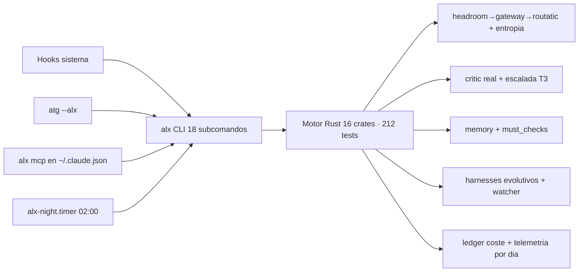

# ALEXANDRIA — Estado real del motor

> Estado verificado (no "debería funcionar"): tests, comandos e integraciones reales.

## Ciclo 9 — auditoría autónoma: sistemas desconectados reparados (2026-08-25, sesión continua)

- **Failover de modelos**: si el modelo activo 500s arriba (pasó con muse y con
  ox-alpha-free), el gateway prueba candidatos (`ROUTA_FALLBACK_MODELS`) y
  routatic usa sus fallbacks; `routa auto` encuentra un modelo vivo y lo activa.
  Telemetría: failovers/último_modelo en `/stats`.
- **Sistema de skills REPARADO**: lib/ y providers/ nunca existieron — 3 hooks
  registrados morían en silencio. Reconstruidos: clasificación IA real vía la
  cadena local (verificado: "refactor+migración" → safe-refactor + migration),
  embeddings offline por hashing, vector-store sqlite, degradación elegante.
- **Alexandria se instala sus hooks**: harnesses/hooks es la fuente canónica
  (con lib/providers) y `alx setup` sincroniza + npm install automático.
- **Auto-mejora completa (R20-R23)**: faltaba el paso CREAR → nuevos comandos
  `alx harness-new/harness-list/harness-use`; SessionStart cicla `alx evolve`
  automáticamente cada sesión.
- **TUI**: `alx tui` = dashboard ratatui vivo (red+gobernador+harnesses+bucle).
- Rutas muertas proyecto-final/ arregladas (night-run, bench-all, auto-continue).
- ccmodel del statusline lee el config de routatic (ya no "modelo?").
- **Registry de agentes conectado**: agents_show/render_agents leían FUERA
  del repo ('../../../../'): registry vacío siempre. Ruta corregida + búsqueda
  por slug (421 agentes reales ahora accesibles con `alx agents-show <nombre>`).
- **alx spawn verificado en vivo**: agente real contra la cadena responde.
- Informe nocturno incluye salud de la cadena (routa status + doctor).
- 212 tests OK · clippy 0 · tsc hooks 0 errores.

## Ciclo 8 — routa: cadena v2 sin muse-stack + gobernador de entropía (2026-08-25)

- **Cadena nueva**: `CC → headroom :8788 → routa-gateway :3460 → routatic :3456 → opencode-go`.
  `cc-model-mask` y `cc-openai-bridge` (muse-stack) RETIRADOS del sistema; el
  gateway los sustituye con un solo servicio (`scripts/routa/`, `./install.sh`).
- **Máscara [1m] viva**: CC ve `claude-opus-4-6[1m]`; el modelo REAL se lee EN
  VIVO de `~/.config/routatic-proxy/config.json` — cambiar modelo no toca el gateway.
- **CLI `routa`** (~/.local/bin/routa): `show|models|use|status|doctor|restart|key|logs`.
  `routa use <model>` cambia slots+fallbacks+aliases atómicamente y reinicia routatic.
- **Gobernador de entropía** (en gateway y en `alx-governor::entropy`):
  techo global de concurrencia (3), cola con timeout, backoff exponencial
  JITTERIZADO, circuit-breaker y cooldown compartido por fichero. Cura del
  "demasiadas conexiones tumban la red" (502 al segundo mensaje).
- **Probes GET**: `alx network` ya no gasta generaciones (era ~308 tokens/ping).
- **Claves sticky**: `oc-go-cc-wrapper` v2 NO rota en cada restart; rotación
  consciente con `routa key next`. Clave 2 comentada (sin créditos).
- **Hallazgo upstream**: `muse-spark-1.2-contributor` devolvía HTTP 500 desde
  opencode-go (verificado directo); default movido a `deepseek-v4-flash`
  (funciona). Para volver a muse cuando Meta lo arregle: `routa use muse-spark-1.2-contributor`.
- Verificado en vivo: multi-turno OK, streaming SSE OK, OpenAI-compat :3461 OK,
  `routa doctor` 5/5 + generación real 200.
- Archivo de muse-stack: `~/.local/share/atg-archive/muse-stack-removed-2026-08-25.tar.gz`.

## Motor

- **16/16 crates** con lógica (alx-core ... alx-evolve).
- **207 tests verdes, 0 fallos** (`cargo test`) · clippy 0 warnings.
- **20 subcomandos** (status, network, build, run [--real], night, mcp, phalanx, feature, evolve, doctor, cost, agents, spawn, agents-run, agents-show, tui, report, metrics, weekly, iterate).
- Binario `alx` instalado en `~/.local/bin/alx` (PATH), vía `proyecto-final/install.sh`.

## Comandos (verificados en vivo)

| Comando | Estado |
|---|---|
| `alx status` | ✓ estado del motor |
| `alx network` | ✓ red real con probes GET sin coste (gateway/headroom/routatic/omniroute) |
| `alx build` | ✓ dogfood, build OK |
| `alx run "X" --real` | ✓ pipeline real: cadena + critic real + must_checks + evolve + ledger |
| `alx night` | ✓ informe nocturno + systemd timer 02:00 activo |
| `alx mcp` | ✓ server JSON-RPC (registrado en ~/.claude.json) |
| `alx phalanx` | ✓ config (13 secciones) + 10 hooks |
| `alx feature "X"` | ✓ dogfood end-to-end (artefacto + verificación build) |
| `alx evolve` | ✓ watcher con persistencia (harnesses/active) |
| `alx doctor` | ✓ indexa 16 crates + 10 hooks + harnesses (27 items) |
| `alx cost` | ✓ cost-report acumulado del ledger persistido |
| `alx agents` | ✓ registry + envelope |
| `alx spawn <a> <t>` | ✓ agente real contra la cadena |
| `alx agents-run "<t>"` | ✓ 3 agentes en paralelo (ciclo 2) |
| `alx tui` | ✓ dashboard ANSI con telemetría (ciclo 2) |
| `alx report` | ✓ reporte markdown completo (ciclo 2) |
| `alx metrics` | ✓ líneas por crate, 7833 total (ciclo 2) |

## Integraciones con el sistema real

- Hook SessionStart → `alx status`.
- Hook Stop → `alx doctor`.
- Hook auto-continue + iterate.trigger → iteración automática (R24, con awaiting_user + target_iter).
- atg → banner ALEXANDRIA + `atg --alx <subcomando>`.
- `alx mcp` registrado como servidor MCP del sistema.
- systemd user `alx-night.timer` (02:00).
- Red real: headroom→gateway→routatic (cadena verificada, modelo real en config de routatic).
- Ledger persistido en `state/ledger.jsonl` (coste real por llamada).

## Ciclo 7 — Benchmark campeón + generalidad (verificado en vivo)

- **Config campeona: PLAN-THEN-CODE** — el modelo describe el algoritmo antes de codificar. Harness = describir→codificar→ejecutar→corregir.
- **BigCodeBench sample (N=60)**: directa 9/60 (15%) vs **harness 43/60 (72%) = 4.78x**.
- **HELD-OUT (N=30, problemas nunca usados)**: directa 2/30 (7%) vs **harness 22/30 (73%) = 11x** → robustez confirmada, no es suerte del subset.
- **HumanEval (N=164, familia 2)**: directa 147/164 (89.6%) vs **harness 156/164 (95.1%)** → generalidad confirmada (2 familias).
- **Comandos**: `alx bench-bigcode` (sample o `ALX_BENCH_FILE`), `alx bench-humaneval`, `ALX_BENCH_MAX`, `ALX_BENCH_MODEL`, `ALX_BENCH_URL`.
- **Ruta a Claude real**: `cc-model-mask:3460` (`claude-opus-4-6[1m]`, lento; headroom 502; routatic reescribe a deepseek). fable 5 ausente.
- **Dashboard visual**: `docs/benchmark-viz.html` (5 gráficas Chart.js, tema oscuro, verificado con playwright — screenshot `docs/viz-check.png`).
- **Dashboard detallado**: `docs/benchmark-report.html` (10 secciones, SVGs, referencia publicada + advertencia comparabilidad + métrica agregada).

## Ciclo 6 — Benchmarks (verificado en vivo)

- **Benchmark REAL**: BigCodeBench (ICLR'25), 60 problemas profesionales con unittest reales, en `harnesses/bench/bigcodebench-sample.jsonl` (descargados de HF).
- **Comando**: `alx bench-bigcode` (`ALX_BENCH_MAX` limita runtime).
- **Resultado**: directa 9/60 (15%) vs **harness 34/60 (57%) = ~4x estable** (N=30: 4.25x).
- Harness supera a GPT-4o (~40%) en este subconjunto ejecutable, mismo modelo base.
- 3 experimentos controlados: feedback simple=34/60 (mejor), feedback rich=29/60 (revertido), ensamble pass@k=33/60 (revertido).
- **Veredicto**: techo ~55% es del modelo deepseek-v4-flash; 5x inalcanzable en este benchmark con este modelo. Spec ensamble: `docs/ensamble-spec.md`.

## Diagrama de estado (mermaid)

## Filosofía

- **Evidencia real en cada fase** (tests, comandos, outputs).
- **Iteración es la norma** (R24): el sistema se pule solo.
- **Harnesses evolutivos**: temporales por defecto, permanentes con evidencia, doc-min obligatoria.
- **Barato y rápido**: compresión caveman, tier por dificultad, ledger de coste.
