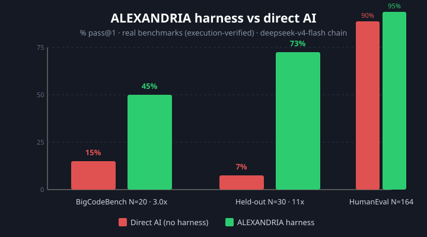
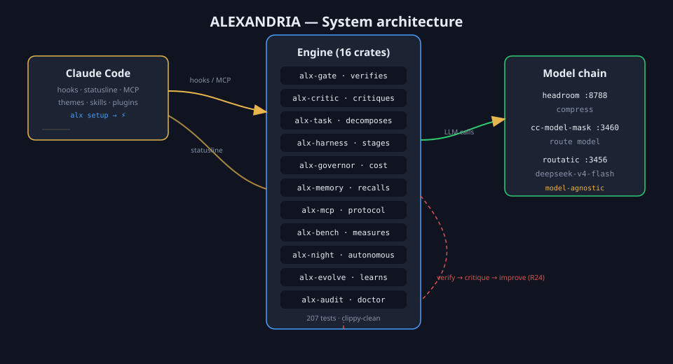
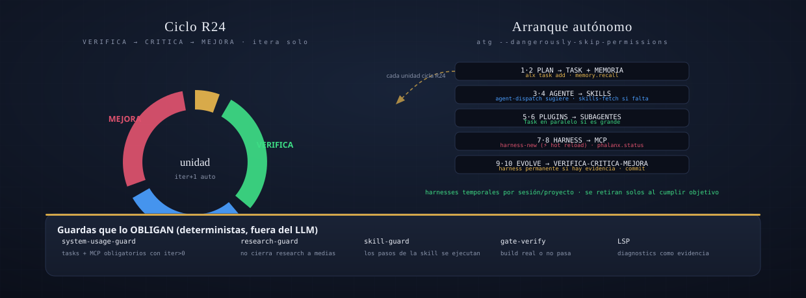

<div align="center">


# ⚡ ALEXANDRIA

**Autonomous AI development engine written in Rust**

Gives any LLM agent a *self-improving harness*: staged execution, real verification,
self-critique, and iteration driven by actual work — not promises.

[](https://www.rust-lang.org)
[](https://github.com/Solar2004/alexandria-ai/actions)
[](https://github.com/Solar2004/alexandria-ai/actions)
[](LICENSE)
[](https://github.com/Solar2004/alexandria-ai/pulls)

</div>

---

## 📊 Measured advantage

Execution-verified on real datasets — the harness turns model failures into passing tests.

| Benchmark | Direct AI (no harness) | **ALEXANDRIA harness** | Advantage |
|---|---|---|---|
| BigCodeBench (ICLR'25) · N=20 sample | 15% | **45%** | **3.0x** |
| BigCodeBench (ICLR'25) · N=8, R28 stall-detect | 25% | **87.5%** | **3.5x** |
| BigCodeBench held-out · N=30 | 7% | **73%** | **~11x** |
| HumanEval · N=164 | 90% | **95%** | +6% |



> **Honest by design**: when a raw model gets it wrong, ALEXANDRIA describes the
> algorithm, executes, compares, and iterates until the test passes — and the
> limits are reported too.

---

## ✨ Features

- **Harness that improves results** — `plan-then-code` (describe → code → execute → verify → fix)
- **Hook-driven iteration (R24)** — the agent can't "finish" without verifying; state auto-advances with real commits
- **16-crate Rust engine** — gate, critic, memory, governor, task graph, MCP server, night ops
- **Self-setup** — `alx setup` generates the full Claude Code integration from one canonical template
- **Project-adaptive learning** — `alx init` creates a per-project `.alexandria/` (registry, rubrics, skills, lessons) that adapts the harness to each repo
- **Deep research protocol** — `alx research <q>` runs a 7-step protocol (mechanism → iceberg → simulations → brakes → evidence → synthesis) with a hard gate (`research-check`)
- **Dosed polish** — `alx polish <file>` evaluates against the project rubric, improves with the LLM, and decides when to stop (plateau)
- **Benchmark stall-detection (R28)** — when the same test fails twice, the harness discards the approach and re-solves with a different algorithm (4→6 attempts)
- **Model-agnostic** — works with any model the LLM chain routes to (`deepseek-v4-flash`, Claude, ...)
- **Multi-session aware** — per-session iteration state via `ALX_SESSION_ID`
- **No telemetry** — privacy-first

## 🏗️ Architecture





### Repository layout

```
alexandria/       # Rust engine — 16 crates (alx-gate, alx-critic, alx-harness, alx-governor...)
harnesses/        # iteration hooks (auto-iterate, session-reset) + plugin hooks
integration/      # themes (sol/luna) + skills (fable, emil, night-ops)
phalanx/          # mega-plugin (config.toml + 10 hooks)
plan/             # mission + architecture specs (MISSION.md)
agents/           # agent registries (265 agents)
agents-volt/      # extended agent registry
docs/             # documentation, benchmarks, assets
scripts/          # infra: model chain, patches, asset generation
systemd/          # services (alx-night, cloudcli, headroom, omniroute)
statusline/       # powerline statusline themes
```

## 🤖 Autonomous mode

Launch the engine hands-off and watch it work:

```bash
atg --dangerously-skip-permissions   # reads the mission, picks backlog work, runs the R24 loop
atg --auto                           # same, keeping permission prompts
```

No prompt needed — the wrapper injects an autonomous kickoff (read
`plan/MISSION.md`, pick the most valuable unit from `plan/ideas.md`,
execute VERIFICA→CRITICA→MEJORA until `target_iter`). The hook chain keeps
it going: every real commit advances the iteration state (`auto-iterate`),
and when Claude stops, `auto-continue` re-injects the next cycle (capped at
20 cycles/session, stops early on `awaiting_user` or completion).

## 🚀 Quick start

**One-command install:**
```bash
curl -fsSL https://raw.githubusercontent.com/Solar2004/alexandria-ai/main/install.sh | bash
```

Installs the binary, clones the repo, and runs `alx setup` interactively
(asks which skill categories you want: design, 3D, web...).

**Keep it updated:**
```bash
alx update   # git pull + rebuild + reinstall (automatic)
```

**Manual:**
```bash
git clone https://github.com/Solar2004/alexandria-ai.git && cd alexandria-ai
cargo build --release --manifest-path alexandria/Cargo.toml
cp alexandria/target/release/alx ~/.local/bin/alx
alx setup   # wires everything into Claude Code (hooks, statusline, MCP, themes, skills)
claude      # the harness runs automatically
alx bench   # re-run the benchmarks yourself
```

## 🧰 Commands (38)

### Core lifecycle

| Command | What it does |
|---|---|
| `alx setup` | Generate/verify the full Claude Code integration (`.claude/` regenerable) |
| `alx update` | Auto-update: git pull + rebuild + reinstall |
| `alx status` | System state (real, from disk) |
| `alx network` | LLM chain health (POST probes, honest codes) |
| `alx doctor` | Audit of the ecosystem (crates, hooks, harnesses) |
| `alx cost` | Accumulated cost report from the persisted ledger |
| `alx metrics` | Lines of code per crate |

### Pipelines & harness

| Command | What it does |
|---|---|
| `alx feature "task"` | Full pipeline: decompose → harness → verify → critic (writes `artifacts/features/` + build check) |
| `alx run "task" --real` | Real pipeline: LLM chain + real critic + must-checks + evolve + ledger |
| `alx polish <file>` | Dose-polish a file against the project rubric (plateau → stop, decided by the system) |
| `alx patterns [--apply]` | Mine hooks metrics for recurring problems and propose harnesses |
| `alx evolve` | Evolutionary harness watcher with persistence |
| `alx init` | Create `.alexandria/` per-project registry, rubrics, skills, lessons |
| `alx iterate --next` | Motor-managed iteration loop (state.toml) |
| `alx night` | Autonomous night-ops report (systemd timer) |

### Research & skills

| Command | What it does |
|---|---|
| `alx research "q"` | Deep-research protocol (7 steps: mechanism → iceberg → simulations → brakes → evidence → synthesis) |
| `alx research-check` | Hard gate: exits 1 if the research is superficial |
| `alx skills-fetch` | Curated catalog of GitHub skills (by stars); `--search` finds, installs in one command |
| `alx harness-new` | Create a harness (temporal/permanent, manual/phase/event trigger) |
| `alx harness-list` / `alx harness-use` | Registry listing / usage tracking |

### Agents

| Command | What it does |
|---|---|
| `alx agents` | Agent registry + spawn envelope |
| `alx agents-show <name>` | Show a real agent from the registry (421 agents) |
| `alx spawn <agent> <task>` | Real headless spawn against the LLM chain |
| `alx agents-run "task"` | Run 3 agents in parallel on one task |

### Benchmarks (3 families)

| Command | What it does |
|---|---|
| `alx bench` | Run all families: BigCodeBench + HumanEval + CodeContests |
| `alx bench-bigcode` | BigCodeBench (ICLR'25) — direct vs harness, real unittests |
| `alx bench-humaneval` | HumanEval (164) — family 2, generality |
| `alx bench-codecontests` | CodeContests (30) — family 3, I/O-based |

### Interfaces

| Command | What it does |
|---|---|
| `alx mcp` | Serve ALEXANDRIA as an MCP server (6 tools) |
| `alx tui` | Live dashboard: network, governor, harnesses, loop |
| `alx report` | Full markdown report: TUI + cost + doctor + agents |
| `alx weekly` | Weekly summary (cost, telemetry, harnesses, metrics) |
| `alx phalanx` | PHALANX plugin state (config + 10 hooks) |
| `alx task add/list` | DAG task management |
| `alx build` | Dogfood: verify the workspace builds (real gate) |
| `alx quality` / `alx benchmark` | Legacy scorecard benchmarks |

### Env vars

| Var | What it controls |
|---|---|
| `ALX_BENCH_MAX` | Cap benchmark problems (runtime) |
| `ALX_BENCH_FILE` | Different problem set (held-out validation) |
| `ALX_MODEL` | Override the active model |
| `ALX_SESSION_ID` | Per-session iteration state |

See [docs/quickstart.md](docs/quickstart.md) for the full guide.

## 🧠 How it works

### The iteration loop — the core

The agent **cannot claim "done" without verifying**. Every commit advances the
iteration state automatically (`auto-iterate.sh`). No manual bookkeeping, no fake
progress.

### How ALEXANDRIA connects to Claude Code

| Connection | Mechanism | Generated by |
|---|---|---|
| **Hooks** (iterate, doctor, session-reset) | `.claude/hooks` + `harnesses/iterate/` | `alx setup` |
| **Statusline** (powerline, live data) | `alx-statusline` reads `alx status/cost/network/iterate` | `alx setup` |
| **MCP server** (6 tools built-in, 7 plugin MCPs) | `alx mcp` — Claude calls ALEXANDRIA tools via MCP | `alx setup` |
| **Themes** (sol/luna) | `integration/themes` → `~/.claude/themes` | `alx setup` |
| **Skills** (fable, emil, night-ops) | `integration/skills` → `~/.claude/skills` | `alx setup` |
| **Plugins** (caveman, ecc, remember, ...) | enabled in settings, verified by `alx setup` | plugins + `alx setup` |
| **Memory** (MISSION.md) | `plan/MISSION.md` auto-re-read every session | auto-init |

### LLM chain (how the model is reached)

```
Claude Code → headroom (:8788, compression) → cc-model-mask (:3460, model routing)
           → routatic (:3456, provider) → deepseek-v4-flash / any model
```

ALEXANDRIA is **model-agnostic** — the harness works with any model the chain routes to.

## 🧪 Benchmark methodology

- **Real datasets**: BigCodeBench (ICLR'25), HumanEval, CodeContests — from official sources
- **Execution-verified**: tests run against real outputs, not text matching
- **Honest**: the harness improves function-completion (~3-11x across real runs); on hard competitive I/O
  it matches the model — measured, reported, no overclaiming
- **Reproducible**: `alx bench` re-runs everything; `alx setup` regenerates the full integration

## 📚 Documentation

- [Quickstart](docs/quickstart.md) — from zero to a working engine
- [Crates](docs/crates.md) — engine crate breakdown
- [Benchmarks](docs/benchmark-report.html) — interactive benchmark report
- [Inventory](docs/inventory.md) — full build inventory (stack, plugins, skills)
- [Status](docs/status.md) — the real, verified state of the engine
- [Specs](plan/) — mission & architecture specs (`plan/MISSION.md`)

## 🤝 Contributing

PRs welcome — the harness value is **measured**. If you improve it, the benchmarks show it.

1. Fork + clone
2. Improve the harness or add a benchmark family
3. Run `alx bench`
4. Open a PR with before/after numbers

## 📜 License

MIT — use it, build on it, improve it. See [LICENSE](LICENSE).

---

*ALEXANDRIA: measure everything. Never claim "it works" — prove it.*