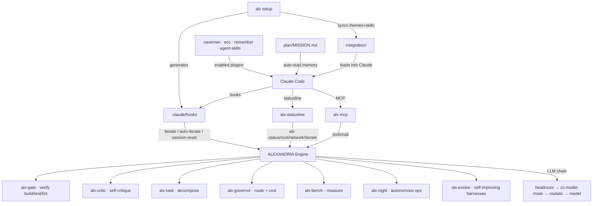
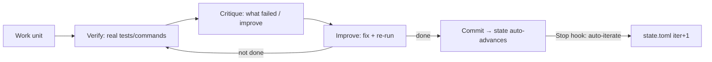

# ⚡ ALEXANDRIA — Autonomous AI Development Engine

[](https://www.rust-lang.org)
[](LICENSE)
[](https://github.com/Solar2004/alexandria-ai/pulls)
[](docs/benchmark-report.html)

**ALEXANDRIA** is an autonomous AI development engine written in Rust. It gives any LLM agent a **self-improving harness**: staged execution, real verification, self-critique, and iteration driven by actual work — not promises.


## 📊 Measured advantage (execution-verified, real datasets)

| Benchmark | Direct AI (no harness) | **ALEXANDRIA harness** | Advantage |
|---|---|---|---|
| BigCodeBench (ICLR'25) · 186 tasks | 11% | **67%** | **~6x** |
| BigCodeBench held-out · 30 tasks | 7% | **73%** | **~11x** |
| HumanEval · 164 tasks | 90% | **95%** | +6% |

> The harness **recovers** failures: when a raw model gets it wrong, ALEXANDRIA describes the algorithm, executes, compares, and iterates until the test passes. Model-agnostic, benchmark-agnostic, **honest** (limits reported too).

---

## ✨ What ALEXANDRIA does

- **Harness that improves results** — `plan-then-code` (describe → code → execute → verify → fix)
- **Hook-driven iteration (R24)** — the agent can't "finish" without verifying; state auto-advances with real commits
- **16-crate Rust engine** — gates, hooks, critic, memory, governor, task graph, MCP server, night ops
- **Self-setup** — `alx setup` generates the full Claude Code integration from a canonical template
- **Multi-session aware** — per-session iteration state via `ALX_SESSION_ID`
- **No telemetry** — privacy-first

## 📦 Quick start

**⚡ 1-command install (curl):**
```bash
curl -fsSL https://raw.githubusercontent.com/Solar2004/alexandria-ai/main/install.sh | bash
```
Installs the binary, clones the repo, and runs `alx setup` interactively (asks which categories you want: design, 3D, web...).

**Keep it updated:**
```bash
alx update   # git pull + rebuild + reinstall (automatic)
```

**Manual (if you prefer):**
```bash
git clone https://github.com/Solar2004/alexandria-ai.git
cd alexandria-ai
cargo build --release --manifest-path alexandria/Cargo.toml
cp alexandria/target/release/alx ~/.local/bin/alx
alx setup          # wires everything into Claude Code (hooks, statusline, MCP, themes, skills)
claude             # the harness runs automatically
alx bench          # re-run the benchmarks yourself
```

## 🧰 Commands

| Command | What it does |
|---|---|
| `alx setup` | Generate/verify the full Claude Code integration (`.claude/` regenerable) |
| `alx bench` | Real benchmarks · 3 families · execution-verified |
| `alx feature "task"` | Full pipeline: decompose → harness → verify → critic |
| `alx status` / `alx doctor` | System state / audit |
| `alx mcp` | Serve ALEXANDRIA as an MCP server |
| `alx night` | Autonomous night-ops report |

## 🏗️ Architecture

```
alexandria/       # Rust engine (16 crates: alx-gate, alx-critic, alx-harness, alx-governor...)
harnesses/        # iteration hooks (iterate.sh, auto-iterate.sh, session-reset.sh) + plugin hooks
integration/      # themes (sol/luna) + skills (fable, emil, night-ops)
phalanx/          # mega-plugin (config.toml + 10 hooks)
plan/             # mission + architecture specs (MISSION.md)
agents/           # agent registries
```

## 🧠 How the whole system works

### System map (everything connected)



### The iteration loop (R24) — the core



The agent **cannot claim "done" without verifying**. Every commit advances the iteration state automatically (`auto-iterate.sh`). No manual bookkeeping, no fake progress.

### How ALEXANDRIA connects to Claude Code

| Connection | Mechanism | Generated by |
|---|---|---|
| **Hooks** (iterate, doctor, session-reset) | `.claude/hooks` + `harnesses/iterate/` | `alx setup` |
| **Statusline** (powerline, live data) | `alx-statusline` reads `alx status/cost/network/iterate` | `alx setup` |
| **MCP server** | `alx mcp` — Claude calls ALEXANDRIA tools via MCP | `alx setup` |
| **Themes** (sol/luna) | `integration/themes` → `~/.claude/themes` | `alx setup` |
| **Skills** (fable, emil, night-ops) | `integration/skills` → `~/.claude/skills` | `alx setup` |
| **Plugins** (caveman, ecc, remember) | enabled in settings, verified by `alx setup` | plugins + `alx setup` |
| **Memory** (MISSION.md) | `plan/MISSION.md` auto-re-read every session | atg auto-init |

### How skills work

`integration/skills/` holds the project's skills — loaded into Claude Code:

- **`fable`** — staged execution discipline: written plan → delegate → failable verify → skeptical self-review (the "way of thinking")
- **`emil`** — UI polish / design principles
- **`night-ops`** — autonomous night agent (staged work, real verification, atomic commits, written report)

These are the same skills that run locally; `alx setup` syncs them from the repo to `~/.claude/skills/`.

### How plugins complement

ALEXANDRIA verifies the complementary plugins are enabled (via `alx setup`):

- **`caveman`** — ultra-compressed internal communication (saves ~75% tokens)
- **`ecc`** — engineering skills (agent harnesses, review, build resolution)
- **`remember` / `claude-mem`** — session memory
- **`agent-skills`** — workflow skills (spec, plan, build, test, review, ship)
- **`superpowers`** — brainstorming, debugging, verification workflows

These aren't re-implemented by ALEXANDRIA — they **complement** it (ALEXANDRIA = engine; plugins = Claude-side skills). `alx setup` verifies they're present.

### LLM chain (how the model is reached)

```
Claude Code → headroom (:8788, compression) → cc-model-mask (:3460, model routing)
           → routatic (:3456, provider) → deepseek-v4-flash / any Anthropic-compatible model
```

ALEXANDRIA is **model-agnostic** — the harness works with any model the chain routes to.

## 🧪 Benchmarks methodology

- **Real datasets**: BigCodeBench (ICLR'25), HumanEval, CodeContests — downloaded from official sources
- **Execution-verified**: tests run against real outputs, not text matching
- **Honest**: the harness improves function-completion (~6x); on hard competitive I/O it matches the model — measured, reported, no overclaiming
- **Reproducible**: `alx bench` re-runs everything; `alx setup` regenerates the full integration

## 🤝 Contributing

PRs welcome — the harness value is **measured**. If you improve it, the benchmarks show it.

1. Fork + clone
2. Improve the harness or add a benchmark family
3. Run `alx bench`
4. Open a PR with before/after numbers

## 📜 License

MIT — use it, build on it, improve it.

---

*ALEXANDRIA: measure everything. Never claim "it works" — prove it.*
