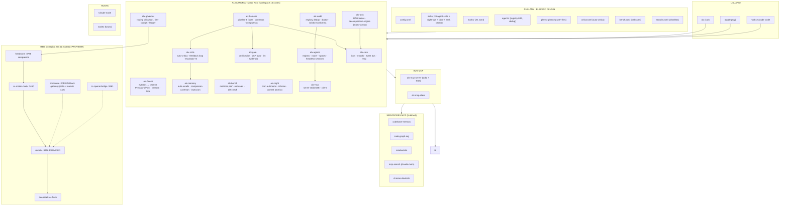
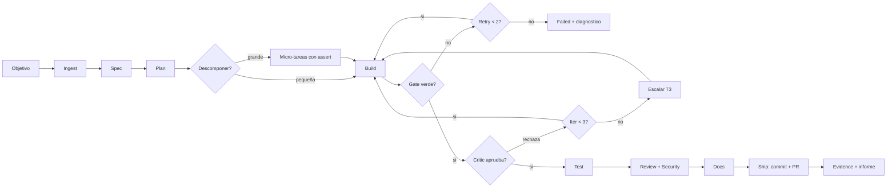
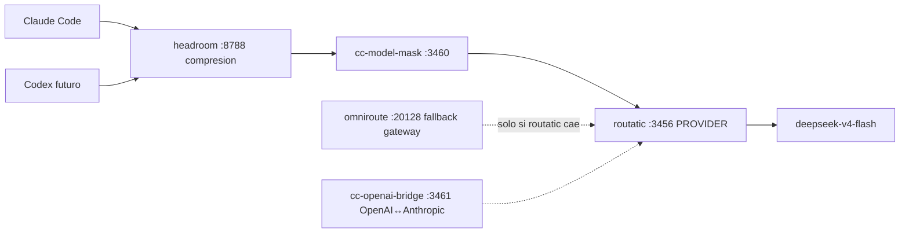

# 02 · Arquitectura — ALEXANDRIA

> Arquitectura final (iteración 40 de 40). Evolución completa: `iterations/architecture-iterations.md`. Base de diseño: auditoría exhaustiva (`14-auditoria.md`) y auto-crítica (`15-critic.md`).

## 1. Principio de capas

```
┌──────────────────────────────────────────────────────────────┐
│  USUARIO  (terminal, `alx`, `atg`)                           │
├──────────────────────────────────────────────────────────────┤
│  PHALANX  (EL ÚNICO plugin: config + skills + hooks + agents)│
├──────────────────────────────────────────────────────────────┤
│  ALEXANDRIA  (motor Rust — 15 crates)                        │
│   core · hooks · memory · governor · task(+decomp) · harness │
│   gate · bench · critic · audit · night · mcp · agents       │
├──────────────────────────────────────────────────────────────┤
│  BUS MCP  (server propio + clientes a 10 servers existentes) │
├──────────────────────────────────────────────────────────────┤
│  RED  (headroom → mask → routatic → deepseek; omniroute, br) │
└──────────────────────────────────────────────────────────────┘
```

Nada salta capas. El motor lo ve todo; el usuario solo ve PHALANX.

## 2. Mermaid MEGA — el sistema completo (iteración 40)



## 3. Mermaid del PIPELINE con decisiones (el "cuándo pasa, ifs")



## 4. Mermaid de RED (cadena canónica)



## 5. Workspace de crates (15)

| Crate | Responsabilidad | Deps clave |
|---|---|---|
| `alx-core` | Tipos, estado, event bus, reloj, IDs | serde, thiserror |
| `alx-hooks` | Ciclo de vida de hooks: registrar, disparar, timeout, lock, retry | tokio, serde_json |
| `alx-memory` | Auto-recalls: capturar, comprimir (caveman), inyectar | alx-core |
| `alx-governor` | Routing (dificultad→tier→ruta real), compresión, presupuesto, ledger | reqwest |
| `alx-task` | DAG de tareas + decomposition engine (micro-tareas con assert) | alx-core |
| `alx-harness` | Pipeline de fases: contratos, compuertas, reanudable | alx-core, alx-task |
| `alx-gate` | Runner de verificación: build/test/lint, LSP discovery, evidencia | tokio |
| `alx-bench` | Métricas de perf, umbrales, diff check | criterion, toml |
| `alx-critic` | **Auto-crítica**: feedback loop, escalada, critic.learn | alx-memory, alx-gate |
| `alx-audit` | **Registry dedup**: indexa skills/agents/plugins/hooks del ecosistema, doctor | serde |
| `alx-night` | Scheduler autónomo, cron, informe, commit atómico | cron, git2 |
| `alx-mcp` | Server (stdio/SSE) + client a 10 servidores existentes | rmcp, tokio |
| `alx-agents` | Registry, router, spawn, headless sessions (summoning) | alx-core |
| `alx-cli` | Binario `alx`: subcomandos, TUI estado, merge atg | clap, ratatui |
| `alx-lib` | Fachada pública: todo lo que PHALANX expone | — |

**Regla de dependencias**: apuntan hacia abajo (core es hoja). `alx-cli` y `alx-lib` son las únicas entradas.

## 6. Flujo de datos canónico (una sesión, con crítica)

1. `alx` arranca → `alx-core` carga estado + `alx-memory` inyecta recalls + `alx-audit` valida ecosistema.
2. Hook `UserPromptSubmit` → `alx-hooks` dispara cadena (mission, governor.classify, skill.activation).
3. `alx-governor` clasifica dificultad → tier → **ruta real** (headroom→mask→routatic).
4. `alx-task` descompone el objetivo en micro-tareas (assert por paso).
5. `alx-harness` recorre fases; `alx-gate` verifica cada micro-tarea; `alx-critic` pule hasta aprobar.
6. `alx-bench` mide contra umbrales antes de merge.
7. `alx-critic` aprende: errores corregidos → `must_check` futuros.
8. `alx-memory` captura aprendizajes → store. Hook `Stop` → night agenda siguiente pasada.

## 7. Mapa a requisitos (R1–R19)

| Requisito | Componente |
|---|---|
| R1 sistema autónomo definitivo | ALEXANDER (todo) |
| R2 motor Rust | workspace 15 crates |
| R3 un solo plugin | alx-lib → PHALANX |
| R4 nada de comandos, todo hooks | alx-hooks + catálogo 20 hooks |
| R5 harness por fase | alx-harness (8 fases) |
| R6 auto-memoria | alx-memory |
| R7 optimización de hablar | alx-governor (compresión caveman) |
| R8 objetivos automáticos | alx-task (goal engine) |
| R9 LSP/lint/tests auto | alx-gate |
| R10 perf matemático | alx-bench |
| R11 conectar skills+workflow | alx-mcp + alx-harness |
| R12 mermaid ≥20 iteraciones | iterations/ (40 hechas) |
| R13 guardar memoria | MISSION.md + alx-memory |
| R14 autónomo | alx-night + night-ops |
| R15 auditar ecosistema, sin duplicados | alx-audit (86 skills, 842 agents, 26 plugins) |
| R16 mermaid grande con ifs | este doc §2–4 |
| R17 descomponer tareas (imposible fallar) | alx-task decomposition engine |
| R18 auto-crítica sin aprobación | alx-critic |
| R19 sesiones headless simples | alx-agents headless + summoning |

## 8. Decisión clave

**PHALANX es config + contenido; ALEXANDRIA es el cerebro; el critic es la conciencia.** Sin critic, el sistema ejecuta; con critic, el sistema mejora. La falange conquista porque aprende de cada batalla.
