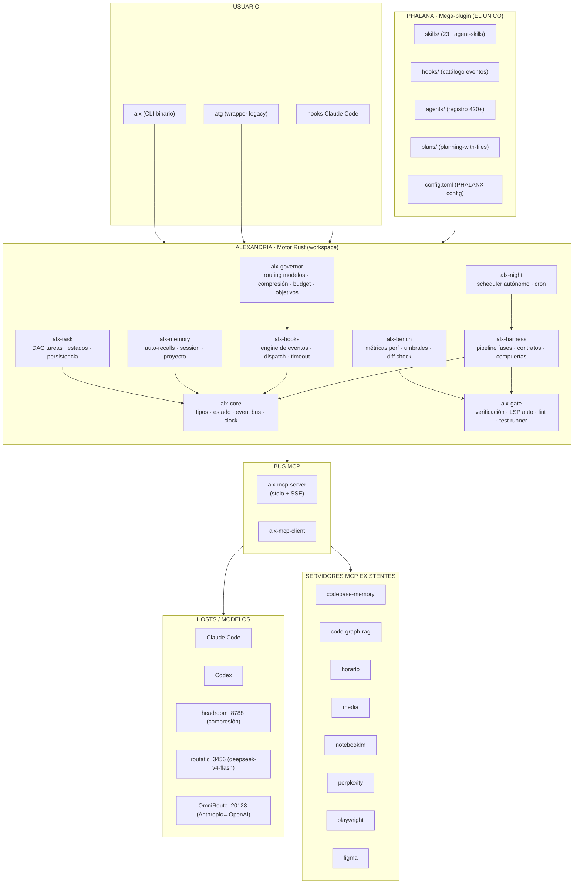

# 02 · Arquitectura — ALEXANDRIA

> Arquitectura final (iteración 20 de 20). El log de evolución de las 20 iteraciones está en `iterations/architecture-iterations.md`.

## 1. Principio de capas

```
┌──────────────────────────────────────────────────────────┐
│  USUARIO  (terminal, `alx`, `atg`)                       │
├──────────────────────────────────────────────────────────┤
│  PHALANX  (mega-plugin: skills + hooks + agentes + plan) │
├──────────────────────────────────────────────────────────┤
│  ALEXANDRIA  (motor Rust — crates)                       │
│   hooks · memory · governor · harness · task · gate      │
├──────────────────────────────────────────────────────────┤
│  BUS MCP  (server propio + clientes a servidores ajenos) │
├──────────────────────────────────────────────────────────┤
│  HOSTS  (Claude Code, Codex, headroom, routatic, Omni)   │
│  SERVS  (codebase-memory, figma, playwright, perplexity…)│
└──────────────────────────────────────────────────────────┘
```

Nada salta capas. El motor lo ve todo; el usuario solo ve PHALANX.

## 2. Mermaid — arquitectura final



## 3. Workspace de crates

| Crate | Responsabilidad | Deps clave |
|---|---|---|
| `alx-core` | Tipos, estado global, event bus, reloj, IDs | serde, thiserror |
| `alx-hooks` | Ciclo de vida de hooks: registrar, disparar, timeout, lock, retry | tokio, serde_json |
| `alx-memory` | Auto-recalls: capturar aprendizajes, comprimir (caveman), inyectar en prompt | alx-core |
| `alx-governor` | Router de modelos (dificultad→tier), compresión, presupuesto de tokens, goal engine | alx-core, reqwest |
| `alx-task` | DAG de tareas: estados, dependencias, persistencia JSONL/RocksDB | alx-core |
| `alx-harness` | Pipeline de fases: contratos entrada/salida, compuertas, reanudable | alx-core, alx-task |
| `alx-gate` | Runner de verificación: build/test/lint, LSP discovery, captura de evidencia | tokio |
| `alx-bench` | Métricas de perf, umbrales, comparación de diffs, informe | criterion, toml |
| `alx-night` | Scheduler autónomo, cron, informe nocturno, commit atómico | cron, git2 |
| `alx-mcp` | Server (stdio/SSE) + client para servidores existentes | rmcp/tokio, serde_json |
| `alx-cli` | Binario `alx`: subcomandos, TUI de estado, merge con atg | clap, ratatui |
| `alx-lib` | Fachada pública: todo lo que PHALANX expone | — |

**Regla de dependencias**: apuntan hacia abajo (core es hoja). `alx-cli` y `alx-lib` son los únicos crates de entrada.

## 4. Flujo de datos canónico (una sesión)

1. `alx` arranca → `alx-core` carga estado + `alx-memory` inyecta recalls en el prompt.
2. Hook `UserPromptSubmit` → `alx-hooks` dispara cadena de hooks (memoria, governor, skill-activation).
3. `alx-governor` clasifica la petición: dificultad → tier de modelo → ruta (headroom/routatic/omniroute).
4. `alx-task` materializa o actualiza el DAG de tareas para el objetivo.
5. `alx-harness` recorre fases; cada fase llama a `alx-gate` para verificar (build/test/lint/LSP).
6. `alx-bench` mide perf y compara contra umbrales antes de merge.
7. `alx-memory` captura aprendizajes de la sesión → comprimidos → store.
8. Hook `Stop` → `alx-night` (si es noche) programa siguiente pasada / actualiza memoria.

## 5. Mapa a requisitos

| Requisito | Crate |
|---|---|
| R2 motor Rust | todo el workspace |
| R3 un plugin | alx-lib → PHALANX |
| R4 nada de comandos | alx-hooks (catálogo completo) |
| R5 harness por fase | alx-harness |
| R6 auto-memoria | alx-memory |
| R7 optimización hablar | alx-governor |
| R8 objetivos automáticos | alx-governor (goal engine) |
| R9 LSP/lint/tests auto | alx-gate |
| R10 perf matemático | alx-bench |
| R11 conectar skills+workflow | alx-mcp + alx-harness |
| R14 autónomo | alx-night + night-ops protocol |

## 6. Decisión clave

**PHALANX es config + skills + hooks; ALEXANDRIA es el cerebro.** PHALANX sin ALEXANDRIA = carpeta de markdown. ALEXANDRIA sin PHALANX = binario huérfano. Solo juntos forman la falange.
