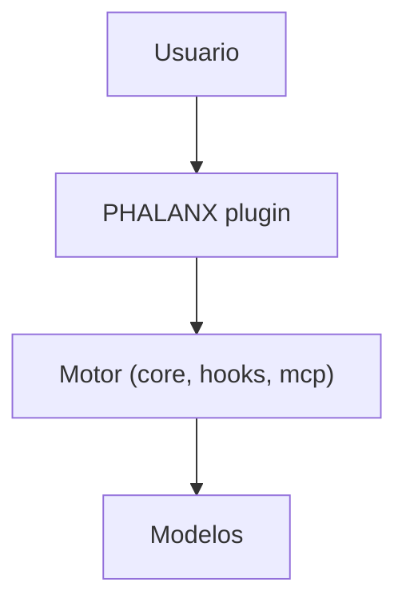
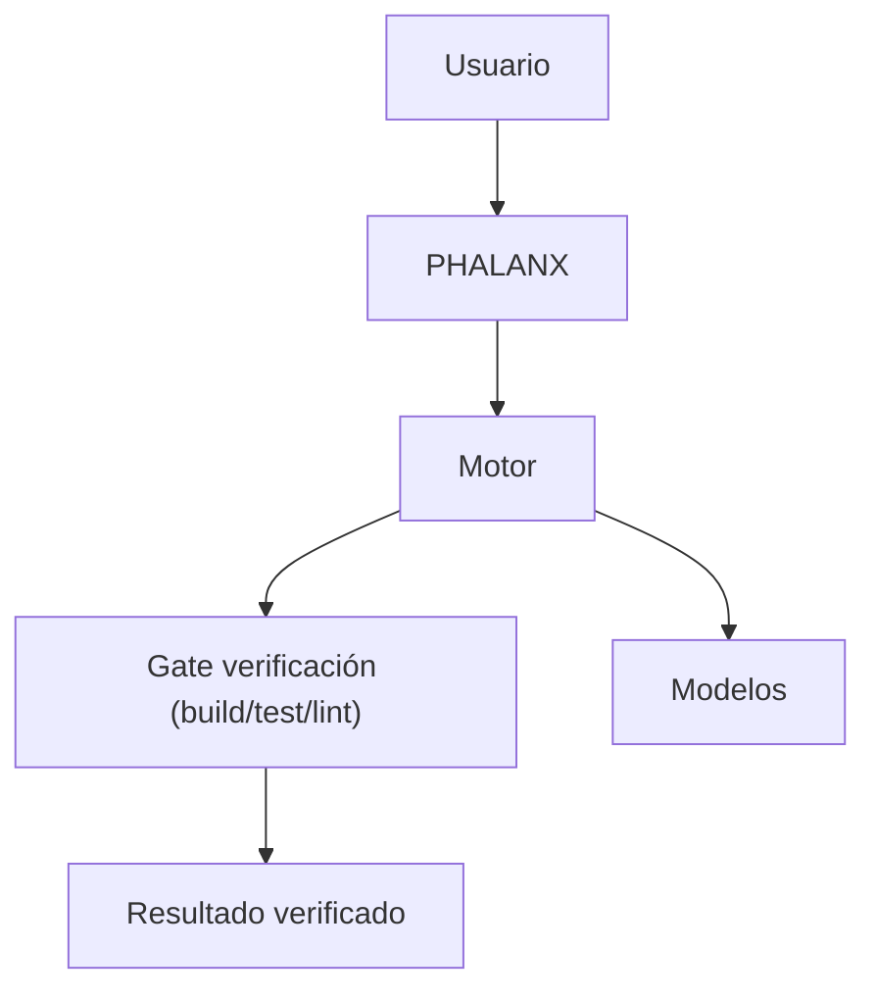
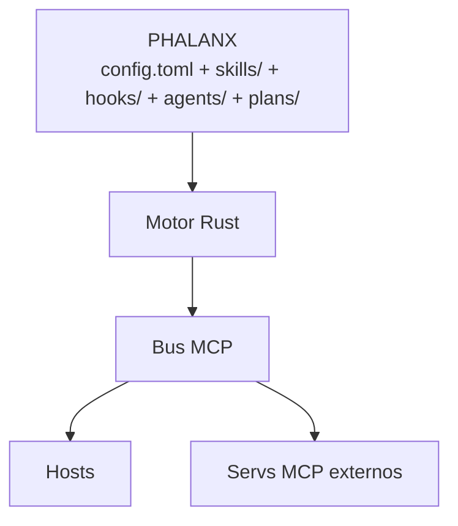

# Iteraciones de Arquitectura — 20 pasos (evidencia del proceso)

> Cada iteración del mermaid de arquitectura, con qué cambió y POR QUÉ.
> Iteración final (20) = `../02-architecture.md`.
> Método: iterar hasta que el diagrama cumpla los 10 requisitos y no tenga redundancia.

## Resumen de las 20 iteraciones

| # | Cambio | Por qué |
|---|---|---|
| 1 | 3 cajas: usuario / motor / modelos | Idea bruta: alguien llama, algo piensa, algo responde |
| 2 | Motor → 4 crates (core, cli, mcp, hooks) | Un binario monólito = frágil y lento de compilar; separación por responsabilidad |
| 3 | Añadir event bus + reloj al core | Todo el sistema es reactivo; sin reloj no hay scheduling ni timeouts |
| 4 | Añadir capa BUS MCP entre motor y modelos | MCP es el bus de integración real (R11); nada habla directo con modelos |
| 5 | PHALANX como capa entre usuario y motor | "Un solo plugin" (R3): el usuario solo toca PHALANX |
| 6 | Hooks conectados a cada crate | Cada evento (prompt, tool, stop) debe poder disparar cualquier crate (R4) |
| 7 | Gobernador de modelos como crate | "Barato" no es un deseo, es un componente: routing + budget (R7) |
| 8 | Memoria como crate | Auto-recalls no pueden vivir en hooks sueltos; necesitan store y compresión (R6) |
| 9 | Separar harness de task | Pipeline de fases ≠ gestión de tareas; son DAGs con responsabilidades distintas |
| 10 | Gate de verificación (mermaid clave 2) | "Asegurarnos con testes que funciona" → compuerta por fase (R9) |
| 11 | Bench de performance | "Aprobado matemáticamente" → métricas + umbrales (R10) |
| 12 | Scheduler nocturno | Autonomía (R14): trabajo sin humano requiere cron + informe |
| 13 | Conectar servidores MCP externos | No reinventar codebase-memory/figma/playwright; consumirlos |
| 14 | `atg` legacy → puente, no duplicado | Ya existe wrapper bash; ALEXANDRIA lo embebe como adaptador |
| 15 | PHALANX = config + skills + agents + plans | El plugin no es código, es configuración viva que el motor ejecuta |
| 16 | Fusionar server/client MCP en un crate | Una sola implementación, dos modos (stdio/SSE); menos duplicación |
| 17 | Regla de dependencias top-down | Solo `alx-cli`/`alx-lib` son entradas; core es hoja → compilación barata |
| 18 | Documentar flujo de datos canónico | Sin flujo definido, los crates no saben quién llama a quién |
| 19 | Mapa requisito→crate | Validar que los 10 requisitos están cubiertos; nada huérfano |
| 20 | Refinar etiquetas + subgraph directions | Legibilidad: el diagrama se convierte en la referencia del repo |

## Mermaid clave #1 (iteración 5) — aparece PHALANX

## Mermaid clave #2 (iteración 10) — aparece el gate

## Mermaid clave #3 (iteración 15) — PHALANX es config viva

## Iteración 20 (FINAL) — ver `../02-architecture.md`

Diagrama completo: usuario → PHALANX → ALEXANDRIA (9 crates) → BUS MCP → hosts + servs externos.

## Lecciones de las 20 iteraciones

1. **El motor debe ser un workspace, no un binario** — cada subsistema escala solo.
2. **MCP es el bus, no una opción** — sin capa MCP, cada crate reinventa la integración.
3. **El plugin es configuración, no código** — PHALANX muere y vive por su config; el cerebro es ALEXANDRIA.
4. **La compresión y el routing son arquitectura** — gobernador no es un extra, es lo que hace al sistema "barato y rápido".
5. **Cada fase necesita compuerta** — sin gate, el pipeline no puede declarar éxito con evidencia.
6. **La memoria es un crate con store** — los hooks escriben; el store comprime y re-inyecta.
7. **El scheduling autónomo es un crate** — "trabajo solo" = cron + informe + commit atómico.
8. **Reutilizar > reescribir** — atg, bridges, MCP externos y planning-with-files se embeben, no se rehacen.
