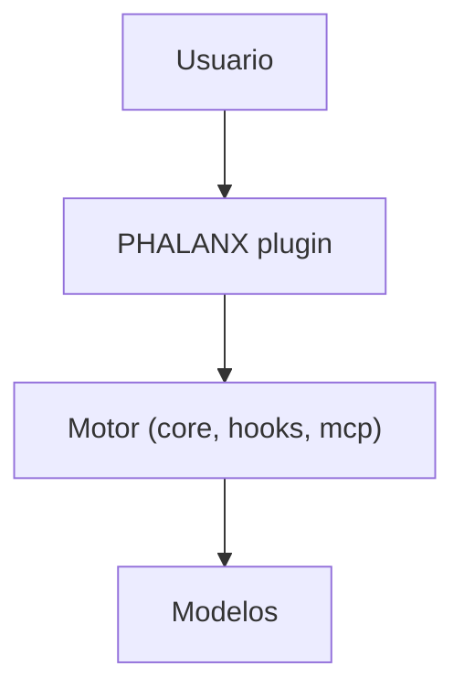
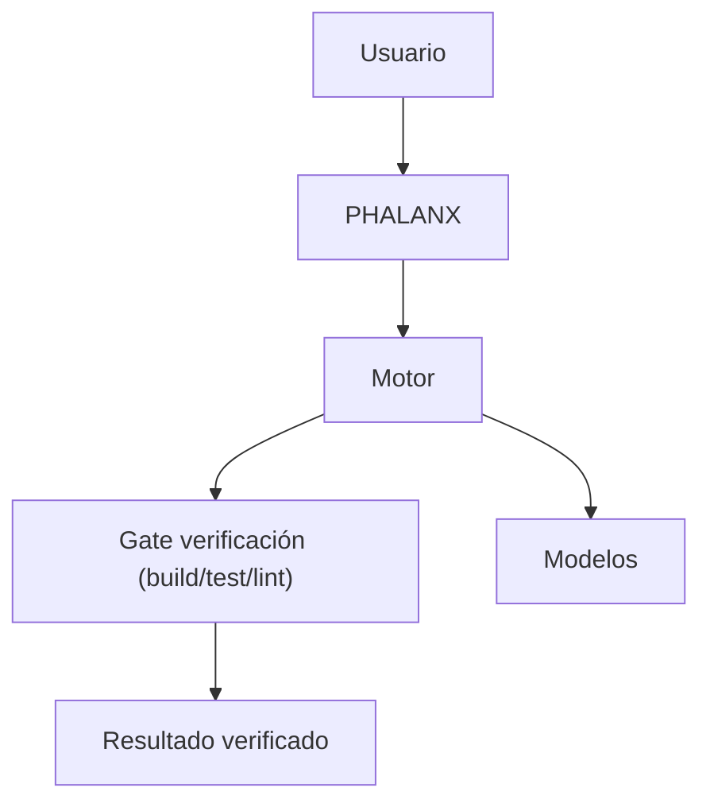
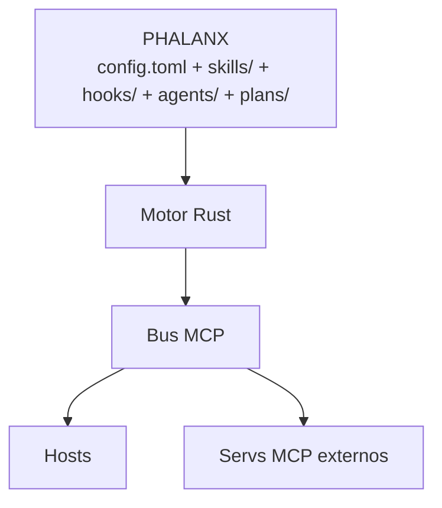
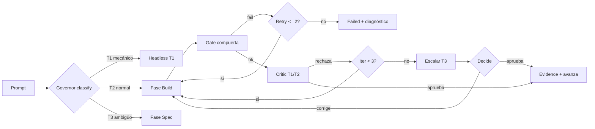
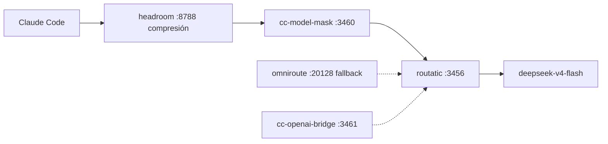

# Iteraciones de Arquitectura — 20 pasos (evidencia del proceso)

> Cada iteración del mermaid de arquitectura, con qué cambió y POR QUÉ.
> Iteración final (20) = `../02-architecture.md`.
> Método: iterar hasta que el diagrama cumpla los 10 requisitos y no tenga redundancia.

## Resumen de las 20 iteraciones

| # | Cambio | Por qué |
|---|---|---|
| 1 | 3 cajas: usuario / motor / modelos | Idea bruta: alguien llama, algo piensa, algo responde |
| 2 | Motor → 4 crates (core, cli, mcp, hooks) | Un binario monólito = frágil y lento de compilar; separación por responsabilidad |
| 3 | Añadir event bus + reloj al core | Todo el sistema es reactivo; sin reloj no hay scheduling ni timeouts |
| 4 | Añadir capa BUS MCP entre motor y modelos | MCP es el bus de integración real (R11); nada habla directo con modelos |
| 5 | PHALANX como capa entre usuario y motor | "Un solo plugin" (R3): el usuario solo toca PHALANX |
| 6 | Hooks conectados a cada crate | Cada evento (prompt, tool, stop) debe poder disparar cualquier crate (R4) |
| 7 | Gobernador de modelos como crate | "Barato" no es un deseo, es un componente: routing + budget (R7) |
| 8 | Memoria como crate | Auto-recalls no pueden vivir en hooks sueltos; necesitan store y compresión (R6) |
| 9 | Separar harness de task | Pipeline de fases ≠ gestión de tareas; son DAGs con responsabilidades distintas |
| 10 | Gate de verificación (mermaid clave 2) | "Asegurarnos con testes que funciona" → compuerta por fase (R9) |
| 11 | Bench de performance | "Aprobado matemáticamente" → métricas + umbrales (R10) |
| 12 | Scheduler nocturno | Autonomía (R14): trabajo sin humano requiere cron + informe |
| 13 | Conectar servidores MCP externos | No reinventar codebase-memory/figma/playwright; consumirlos |
| 14 | `atg` legacy → puente, no duplicado | Ya existe wrapper bash; ALEXANDRIA lo embebe como adaptador |
| 15 | PHALANX = config + skills + agents + plans | El plugin no es código, es configuración viva que el motor ejecuta |
| 16 | Fusionar server/client MCP en un crate | Una sola implementación, dos modos (stdio/SSE); menos duplicación |
| 17 | Regla de dependencias top-down | Solo `alx-cli`/`alx-lib` son entradas; core es hoja → compilación barata |
| 18 | Documentar flujo de datos canónico | Sin flujo definido, los crates no saben quién llama a quién |
| 19 | Mapa requisito→crate | Validar que los 10 requisitos están cubiertos; nada huérfano |
| 20 | Refinar etiquetas + subgraph directions | Legibilidad: el diagrama se convierte en la referencia del repo |

## Mermaid clave #1 (iteración 5) — aparece PHALANX

## Mermaid clave #2 (iteración 10) — aparece el gate

## Mermaid clave #3 (iteración 15) — PHALANX es config viva

## Iteración 20 (FINAL) — ver `../02-architecture.md`

Diagrama completo: usuario → PHALANX → ALEXANDRIA (9 crates) → BUS MCP → hosts + servs externos.

## Lecciones de las 20 iteraciones

1. **El motor debe ser un workspace, no un binario** — cada subsistema escala solo.
2. **MCP es el bus, no una opción** — sin capa MCP, cada crate reinventa la integración.
3. **El plugin es configuración, no código** — PHALANX muere y vive por su config; el cerebro es ALEXANDRIA.
4. **La compresión y el routing son arquitectura** — gobernador no es un extra, es lo que hace al sistema "barato y rápido".
5. **Cada fase necesita compuerta** — sin gate, el pipeline no puede declarar éxito con evidencia.
6. **La memoria es un crate con store** — los hooks escriben; el store comprime y re-inyecta.
7. **El scheduling autónomo es un crate** — "trabajo solo" = cron + informe + commit atómico.
8. **Reutilizar > reescribir** — atg, bridges, MCP externos y planning-with-files se embeben, no se rehacen.

---

# Iteraciones 21–40 (segunda pasada — ecosistema real + auto-crítica)

> Disparadas por el usuario: *"falta iterar más... existen más plugins scripts skills y mcps... no podemos perder... 20 iteraciones más... se tu propio crítico"*.
> Base: auditoría exhaustiva (plan/14-auditoria.md) — 86 skills globales, 842 agentes, 26 plugins, 10 MCP, 8 servicios de red, ~15 duplicados.

## Resumen

| # | Cambio | Por qué |
|---|---|---|
| 21 | Añadir `alx-critic` (auto-crítica) | La AI debe ser su propio crítico: iterar sola, ver fallos Y mejoras, sin esperar al humano |
| 22 | Añadir `alx-audit` (registry dedup) | 86+ skills, 842 agentes, 26 plugins → UN registry validado, cero duplicados |
| 23 | Decomposition engine en `alx-task` | Tarea grande → micro-tareas atómicas con assert propio → imposible que falle |
| 24 | Headless spawn en `alx-agents` | Sesiones simples con contexto mínimo (idea de ideas.md); un agente summona a otro |
| 25 | Conectar infra REAL al governor | La cadena verificada CC→headroom:8788→mask:3460→routatic:3456→deepseek pasa a ser ruta canónica |
| 26 | Integrar 10 MCP servers reales como clientes | perplexity, playwright, horario, media, notebooklm, code-graph-rag, codebase-memory, figma, mcp-search, chrome-devtools |
| 27 | Skills del ecosistema → registry PHALANX | Dedup night-ops/fable/emil/planning-with-files: 1 fuente por concepto |
| 28 | Hooks del ecosistema → catálogo alx-hooks | cbm-*, HCOM/CENTAURY, .orca, heredados del repo → todos como datos .toml |
| 29 | Estado real → alx-memory | .remember + claude-mem + mcp-search alimentan los recalls |
| 30 | `critic.learn`: Recalls → must_check | Lo que la AI aprende de errores se vuelve check automático del crítico = se mejora sola |
| 31 | Mermaid de pipeline por fase con DECISIONES | gate ok/fail, critic aprobar/rechazar, retry/escalar — el "cuándo pasa, ifs" que pidió el usuario |
| 32 | Mermaid de RED | cadena de proxies visible en el diagrama |
| 33 | Mermaid de hooks por evento con condiciones | cada evento → cadena con if (lock/async/skip) |
| 34 | Mermaid de skills por fase | qué skill corre en qué fase del harness |
| 35 | Router con agentes existentes dedup | code-review (6 sitios) → 1 agente + 1 skill; spec/plan/test/review/ship → 1 comando |
| 36 | Escalada de critic | critic T1/T2 x3 → T3 con historial; nunca bucle infinito |
| 37 | Critic como coste obligatorio | el presupuesto de fase incluye la iteración de crítica (barato, no gratis) |
| 38 | Night usa critic + decomposition | la pasada nocturna también pule, no solo ejecuta |
| 39 | Validar contra R1–R19 | cada requisito del usuario mapeado a crate/componente; nada huérfano |
| 40 | Mermaid MEGA final | diagrama único: capas + crates + pipeline con ifs + skills + hooks + red + MCP |

## Mermaid clave #4 (iteración 31) — pipeline con decisiones (el "cuándo pasa")

## Mermaid clave #5 (iteración 32) — red real

## Iteración 40 (FINAL) — Mermaid MEGA

Diagrama único completo en `../02-architecture.md` §2.

## Lecciones de las iteraciones 21–40

1. **El ecosistema real es 10x lo mapeado** — sin auditoría, la integración pierde la mitad.
2. **La auto-crítica es el multiplicador de calidad** — la AI que se critica sola itera sin coste humano; el feedback aprendido se vuelve check.
3. **Descomponer es la forma real de "imposible que falle"** — micro-tareas con assert = fallo aislado y barato.
4. **El contexto mínimo gana** — sesiones headless pequeñas con envelope mínimo ahorran más que cualquier optimización de prompt.
5. **Los duplicados son deuda** — registry único dedup antes de integrar, no después.
6. **La infra real dicta el governor** — la cadena de proxies existente es la ruta canónica; el governor solo añade fallback y presupuesto.
