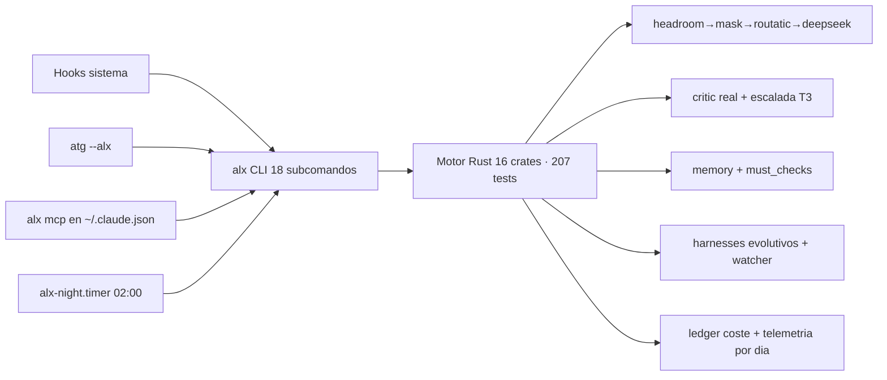

# ALEXANDRIA — Estado real del motor

> Estado verificado (no "debería funcionar"): tests, comandos e integraciones reales.

## Motor

- **16/16 crates** con lógica (alx-core ... alx-evolve).
- **207 tests verdes, 0 fallos** (`cargo test`) · clippy 0 warnings.
- **20 subcomandos** (status, network, build, run [--real], night, mcp, phalanx, feature, evolve, doctor, cost, agents, spawn, agents-run, agents-show, tui, report, metrics, weekly, iterate).
- Binario `alx` instalado en `~/.local/bin/alx` (PATH), vía `proyecto-final/install.sh`.

## Comandos (verificados en vivo)

| Comando | Estado |
|---|---|
| `alx status` | ✓ estado del motor |
| `alx network` | ✓ red real (headroom 200, mask 502, routatic/omniroute 404) |
| `alx build` | ✓ dogfood, build OK |
| `alx run "X" --real` | ✓ pipeline real: cadena + critic real + must_checks + evolve + ledger |
| `alx night` | ✓ informe nocturno + systemd timer 02:00 activo |
| `alx mcp` | ✓ server JSON-RPC (registrado en ~/.claude.json) |
| `alx phalanx` | ✓ config (13 secciones) + 10 hooks |
| `alx feature "X"` | ✓ dogfood end-to-end (artefacto + verificación build) |
| `alx evolve` | ✓ watcher con persistencia (harnesses/active) |
| `alx doctor` | ✓ indexa 16 crates + 10 hooks + harnesses (27 items) |
| `alx cost` | ✓ cost-report acumulado del ledger persistido |
| `alx agents` | ✓ registry + envelope |
| `alx spawn <a> <t>` | ✓ agente real contra la cadena |
| `alx agents-run "<t>"` | ✓ 3 agentes en paralelo (ciclo 2) |
| `alx tui` | ✓ dashboard ANSI con telemetría (ciclo 2) |
| `alx report` | ✓ reporte markdown completo (ciclo 2) |
| `alx metrics` | ✓ líneas por crate, 7833 total (ciclo 2) |

## Integraciones con el sistema real

- Hook SessionStart → `alx status`.
- Hook Stop → `alx doctor`.
- Hook auto-continue + iterate.trigger → iteración automática (R24, con awaiting_user + target_iter).
- atg → banner ALEXANDRIA + `atg --alx <subcomando>`.
- `alx mcp` registrado como servidor MCP del sistema.
- systemd user `alx-night.timer` (02:00).
- Red real: headroom→mask→routatic→deepseek (cadena verificada).
- Ledger persistido en `state/ledger.jsonl` (coste real por llamada).

## Diagrama de estado (mermaid)

## Filosofía

- **Evidencia real en cada fase** (tests, comandos, outputs).
- **Iteración es la norma** (R24): el sistema se pule solo.
- **Harnesses evolutivos**: temporales por defecto, permanentes con evidencia, doc-min obligatoria.
- **Barato y rápido**: compresión caveman, tier por dificultad, ledger de coste.
